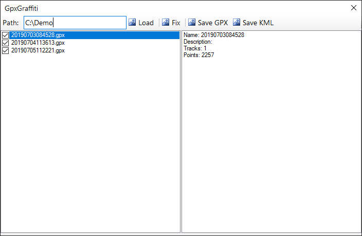

# GpxGraffiti `.NET Framework, C#, WinForms`

## A simple windows application to pre-process gpx files to use in Adobe Lightroom and Google Earth

### Usage

`GpxGraffiti -merge`	Combines multiple gpx files into a single file - used for geotagging in Lightroom`

`GpxGraffiti -fix`	Removes bad data points from a gpx file - cleans up a file with a poor gps signal`

`GpxGraffiti -kml`	Converts a gpx file to a kml file - prepares file for visualizing in Google Earth`

### Process
1. Read and parse GPX file to perform distance calculations
2. Remove points with low signial quality or errors
3. Resegment tracks and add metadata/notes
4. Save data into a single GPX file
5. Convert to unified KML file